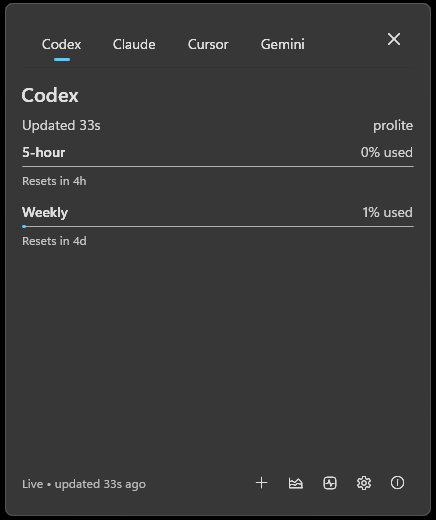
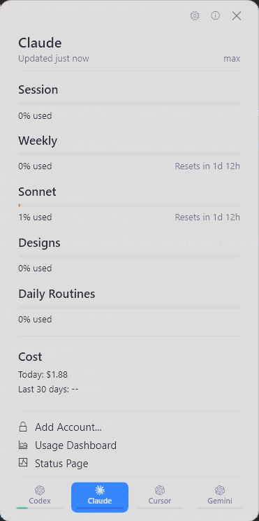
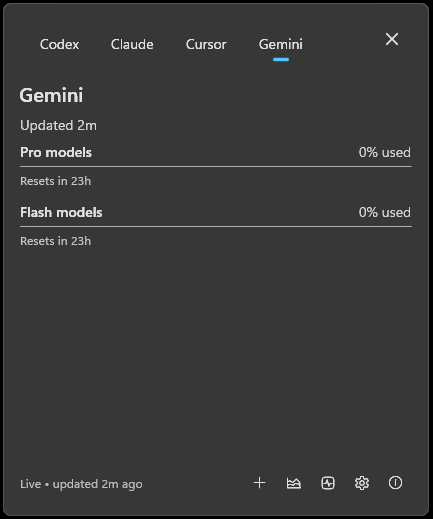

# CodexBar for Windows

A Windows 11 tray app that shows your AI coding-provider usage at a glance — no need to open every provider dashboard. Built on WinUI 3 + Windows App SDK 1.6 with Mica/Acrylic chrome, native Fluent UI, and live theme/accent reactivity.

Supports **Codex, Claude, Cursor, Gemini, and GitHub Copilot.** Reads local CLI credentials directly — your tokens never leave your machine.

## Screenshots

<p>
  
  
  
</p>

## Install

Download the latest release from the [Releases](https://github.com/dontcallmejames/CodexBar-Windows/releases) page. Most users want the `.installer.exe`. A portable zip is also published for users who don't want an installer.

Prefer a package manager? Install with [Scoop](https://scoop.sh):

```pwsh
scoop bucket add codexbar https://github.com/dontcallmejames/scoop-codexbar
scoop install codexbar
```

Scoop installs the portable build and manages updates — run `scoop update codexbar` to upgrade.

Both the installer and the app executable are signed with **Azure Trusted Signing** (Microsoft ID Verified Code Signing). Authenticode reports `Status: Valid` and the publisher is verified by Microsoft; SmartScreen reputation builds over time as downloads accumulate.

Requirements:
- **Windows 11** (Windows 10 22H2 may work but isn't a target)
- **.NET 9 runtime** is bundled in the release artifacts (self-contained)
- Signed-in CLI credentials for whichever providers you enable

## Provider Support Matrix

| Provider | Credential source | Status | Notes |
| --- | --- | --- | --- |
| Codex | Codex CLI OAuth at `%CODEX_HOME%\auth.json` or `%USERPROFILE%\.codex\auth.json` | Supported | Settings can Test credentials and open setup Help. |
| Claude | Claude CLI OAuth at `%USERPROFILE%\.claude\.credentials.json` or manual cookie header | Supported | OAuth is preferred; manual cookies are a fallback. |
| Cursor | Manual `Cookie:` header from a signed-in Cursor browser request | Manual-cookie only | Cursor has no stable public usage API. |
| Gemini | Gemini CLI OAuth at `%USERPROFILE%\.gemini\oauth_creds.json` | Supported | API key and Vertex AI modes are not supported. |
| Copilot | GitHub CLI token via `gh auth token` (run `gh auth login` first) | Supported | Off by default — opt in from Settings after signing in with `gh`. |

## First run

1. Launch `CodexBar.WinUI.exe`.
2. The Welcome window appears on a new install — enable the providers you want to track. Each provider has a Help link explaining where credentials come from.
3. Click Get Started, or Skip to keep defaults and configure later.
4. The tray icon shows your most-constrained provider's usage. Left-click it to open the popover.
5. Right-click the tray icon for Settings, About, or Quit.

## Features

- **Tray popover** with all enabled providers as tabs, Acrylic backdrop, live theme + accent reactivity.
- **Per-provider adaptive backoff**: if a provider rate-limits you, only that provider backs off — the others keep refreshing.
- **Live "updated Ns ago" indicator** that ticks every 5 seconds while the popover is open.
- **Taskbar dock** (optional): a compact strip pinned near the taskbar showing all providers at once.
- **Global hotkey** (default Ctrl+Alt+U, configurable in Settings): toggle the popover from anywhere, even when the tray icon is hidden in the overflow.
- **First-run onboarding**, Settings with Fluent SettingsCard layout, About window, native MenuFlyout right-click menu.
- **Automatic update checks** against GitHub Releases (24-hour cadence, off by default). The app surfaces updates via a Windows AppNotification banner. Settings has an Install now button that downloads the signed installer, verifies it against the published SHA-256 sidecar, launches it elevated, and exits so the installer can replace the running binaries.
- **DPAPI-encrypted secrets**: manual cookie headers (Claude, Cursor) are encrypted at rest with Windows DPAPI tied to your user profile. Plaintext values from older installs are migrated on next save.
- **Accessibility**: every interactive control exposes an `AutomationId` and icon-only buttons expose an accessible `Name`, so Narrator and UI automation tools can navigate the app end-to-end.
- **Local Claude Code token tracking** (when Claude Code is installed): the Claude tab also shows today's local token spend by scanning `~/.claude/projects/**/*.jsonl`, ccusage-style. No network call, no NPX dependency.
- **Credential-expiry surfacing**: when a provider's sign-in expires or is rejected, that tab shows a clear "reconnect" message with the exact re-auth steps (and a one-time toast), instead of going blank or showing stale numbers. Expired credentials are kept distinct from transient network errors and rate limits.

## Updates

CodexBar checks GitHub Releases automatically every 24 hours when enabled in Settings, and you can check manually any time. The Settings window shows your version and the latest release found. When an update is available you can **Install now** — CodexBar downloads the signed installer, verifies its SHA-256, runs it elevated, and relaunches — or use **Open Release** to download from GitHub yourself.

## Provider setup details

Setup notes per provider:
- [Codex on Windows](docs/windows-codex.md)
- [Claude on Windows](docs/windows-claude.md)
- [Cursor on Windows](docs/windows-cursor.md)
- [Gemini on Windows](docs/windows-gemini.md)
- [GitHub Copilot on Windows](docs/windows-copilot.md)

## Privacy

CodexBar reads known credential/configuration files for enabled providers and queries the matching provider endpoint directly. **Provider credentials stay on your machine** and are never sent to any CodexBar-operated service.

The app doesn't crawl your disk. It checks specific paths like `%USERPROFILE%\.codex\auth.json`, `%USERPROFILE%\.claude\.credentials.json`, and `%USERPROFILE%\.gemini\oauth_creds.json`, plus any manual cookie text you paste into Settings.

Manual cookie headers entered in Settings are encrypted at rest with Windows DPAPI under your current user profile — the on-disk value is unusable on a different machine or under a different Windows account.

## Known limitations

- Updates aren't silent: you trigger them from Settings — Install now installs in place, or Open Release downloads from GitHub. The app never updates itself in the background.
- Cursor support requires a manual cookie header you copy from a signed-in browser session.
- Gemini requires Gemini CLI OAuth credentials. API key and Vertex AI modes are not yet supported.
- A provider can show "No usage yet" when credentials are present but the provider returns no measurable usage window.
- Provider dashboards and private usage APIs can change without notice.

## Contributing

The active solution is `src/windows/CodexBar.Windows.sln` (.NET 9, WinUI 3 via Windows App SDK 1.6).

```powershell
dotnet test src\windows\CodexBar.Windows.sln --verbosity minimal
```

Releases use the checklist in [docs/windows-release-checklist.md](docs/windows-release-checklist.md). Provider data is kept siloed per provider; behavior changes need focused tests.

## Credits

Inspired by [CodexBar by steipete](https://github.com/steipete/CodexBar). MIT licensed — see [LICENSE](LICENSE).
</content>
</invoke>